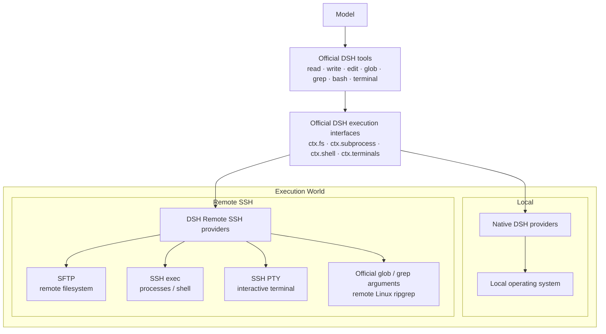

# DSH Remote SSH

[English](./README.md) | [简体中文](./README.zh-CN.md)

Use the native **DeepSeek Harness (DSH)** tools directly on remote Linux servers.

Select a saved server next to the conversation composer and DSH's existing `read / write / edit / glob / grep / bash / terminal` tools run remotely. The plugin does not modify DSH source code, and the server does not need DSH, this plugin, Node.js, or Python installed.


## Features

- Add, test, manage, and select SSH servers inside the DSH Web UI.
- Switch the execution environment between the local computer and saved servers.
- Keep the official DSH tools instead of adding reduced `ssh_*` replacements.
- Use SFTP for files, SSH exec / Shell for commands, and SSH PTY for interactive terminals.
- Preserve native `glob / grep` behavior while resolving and caching ripgrep for the remote Linux host.
- Authenticate with SSH Agent, a private-key file, or a temporary password.
- Verify SSH Host Key fingerprints on first connection and reject unexpected changes.
- Reuse connections maintained by the DSH Host instead of logging in for every message.

## Install

Requires Node.js 24 or newer, with `dsh` and `pnpm` available on `PATH`.

```bat
dsh plugin --profile web add github:NaNQiQ/DeepSeek-Harness-remote-ssh
dsh web
```

If Windows cannot find `pnpm`, run `npm install -g pnpm@11` in CMD and reopen CMD.

## Use

1. Start `dsh web`.
2. Open the execution-environment selector next to the composer.
3. Select **Add server**.
4. Enter the connection, authentication, and default working-directory settings.
5. Follow the built-in authentication guide and verify the server fingerprint.
6. Select **Test and save**.
7. Select the saved server next to the composer.

For later conversations, simply select the saved server. The model continues to use official DSH tools; only the location behind those tools changes.

## Architecture



```text
Native DSH @ Linux
        ≈
DSH @ local computer + DSH Remote SSH → the same Linux host
```

The plugin changes **where DSH executes**, not **how the model uses DSH tools**. See [ARCHITECTURE.md](./ARCHITECTURE.md) for implementation details.

## Authentication

| Method | Behavior |
| --- | --- |
| SSH Agent | Requests signatures without reading private-key contents or enabling Agent Forwarding; suited to personal desktops |
| Private-key file | Persists only the path and reads the file when connecting; suited to dedicated accounts or server deployments |
| Temporary password | Kept only in current DSH Host process memory and must be entered again after restart |

## Remote requirements and security boundary

- The target is a Linux / Unix host with SSH, SFTP, and a POSIX shell.
- Each server can define a default working directory; it is the initial `cwd`, not a path sandbox.
- Effective access equals the permissions of the remote SSH account.
- The Remote Provider does not expose the DSH Host's local filesystem to the remote execution world.
- Model API keys and Base URLs remain managed by DSH; this plugin does not read or store them.

See [SECURITY.md](./SECURITY.md) for details.

## Update and remove

```bat
dsh plugin --profile web update dsh-remote-ssh
dsh plugin --profile web remove dsh-remote-ssh
```

Restart DSH after updating or removing the plugin.

## Documentation

- [ARCHITECTURE.md](./ARCHITECTURE.md) — architecture and implementation
- [SECURITY.md](./SECURITY.md) — security model and credential handling
- [CHANGELOG.md](./CHANGELOG.md) — release history
- [CONTRIBUTING.md](./CONTRIBUTING.md) — development and contributions

## Related project

- [DeepSeek Harness](https://github.com/deepseek-ai/deepseek-harness)

## Friends

- [LINUX DO](https://linux.do/)

## License

[MIT](./LICENSE)
