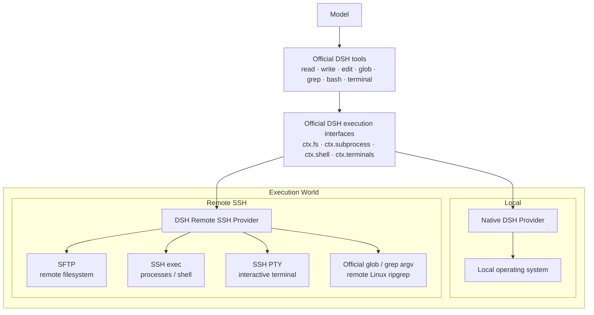

# DSH Remote SSH

[简体中文](./README.zh-CN.md) | [English](./README.md)

Use **DeepSeek Harness (DSH)** on remote Linux hosts without replacing its native tools. The same `read / write / edit / glob / grep / bash / terminal` tools can execute locally or through SSH on a selected server.

> Community project. Not affiliated with or endorsed by DeepSeek.

## Features

- Keeps the official DSH tools; no model-facing `ssh_*` or `remote_*` replacement tools.
- Switches the execution environment of the same conversation between the local machine and configured Linux servers.
- Uses SFTP for remote filesystem access, SSH exec for processes and shells, and SSH PTY for interactive terminals.
- Preserves DSH search semantics for `glob / grep`; the required ripgrep binary is resolved for the remote Linux environment and cached there.
- Treats `cwd` as the initial working directory, not a filesystem boundary; effective access is controlled by the remote SSH account.
- Supports SSH Agent, private-key file, and temporary password authentication.
- Supports SSH Host Key fingerprint confirmation on first connection.
- Does not require the remote Linux host to install this plugin, DSH, Node.js, or Python.
- Shows execution-environment switches in the conversation timeline without sending that UI marker to the model as a user or assistant message.

## Quick start

Prerequisites: DeepSeek Harness is installed and working, and both `dsh` and `pnpm` are available on PATH.

### Install

Install directly from GitHub through the DSH profile plugin mechanism:

```bash
dsh plugin --profile web add github:NaNQiQ/DeepSeek-Harness-remote-ssh
dsh web
```

Optionally verify that the bundle is present in the Web profile:

```bash
dsh --profile web --dump-config
```

The output should contain:

```text
dsh-remote-ssh
```

### Update

```bash
dsh plugin --profile web update dsh-remote-ssh
dsh web
```

If the dependency was installed from a pinned Git tag or commit, updates remain constrained by that pin. Reinstall the desired tag or commit to move to another pinned version.

### Uninstall

```bash
dsh plugin --profile web remove dsh-remote-ssh
```

Then restart DSH.

### Install a specific version

Append a Git tag or commit to the GitHub package spec:

```bash
dsh plugin --profile web add github:NaNQiQ/DeepSeek-Harness-remote-ssh#<tag-or-commit>
```

The README intentionally does not pin a release number. See [CHANGELOG.md](./CHANGELOG.md) and GitHub Releases for version-specific changes.

## Usage

After starting DSH Web:

1. Open the execution-environment selector.
2. Choose **Add server**.
3. Enter the server address, SSH port, and username.
4. Choose SSH Agent, private-key file, or temporary password authentication.
5. Confirm the Host Key fingerprint on first connection.
6. Test and save the server.
7. Switch the current conversation to that server.

The model still sees the official DSH tools. Only the execution location behind those tools changes.

## Architecture



Design goal:

```text
native DSH @ Linux
        ≈
DSH @ local machine + DSH Remote SSH → the same Linux host
```

The plugin changes **where DSH executes**, not **how the model uses DSH tools**.

See [ARCHITECTURE.md](./ARCHITECTURE.md) for the detailed design and boundaries.

## Authentication

### SSH Agent (recommended)

The plugin asks the system SSH Agent to sign authentication challenges. It does not export private-key material from the Agent.

The same Agent identity can be authorized on multiple servers by installing the corresponding **public key** in each server's `~/.ssh/authorized_keys`.

SSH Agent Forwarding is not enabled by this plugin.

### Private-key file

The server configuration stores the private-key path. The plugin reads the selected key when opening an SSH connection.

For passphrase-protected keys, loading the key into SSH Agent and using Agent mode is recommended.

### Temporary password

Passwords are kept only in the current DSH Host process memory for connections and reconnects during that process lifetime.

Passwords are not written to the plugin state file or browser `localStorage` / `sessionStorage`. A DSH Host restart requires entering the password again.

## Remote host requirements

Remote execution currently targets Linux / POSIX SSH hosts with:

- working SSH / SFTP access;
- sufficient permissions for the selected SSH account;
- a normal POSIX shell environment.

The remote host does not need to preinstall:

- DSH Remote SSH;
- DeepSeek Harness;
- Node.js;
- Python.

The ripgrep binary required by search is handled and cached by the plugin for the remote environment; users do not need to configure a system `rg` manually.

## Security

- Model-provider API keys and model Base URLs remain managed by DSH; this plugin does not read or persist them.
- First-use SSH Host Key fingerprints can be verified before trust is stored.
- Remote execution has the permissions of the selected SSH account.
- The Remote Provider does not expose the DSH Host's local filesystem to the remote execution world.
- Local mode deliberately preserves native DSH behavior. If the local OS user can already read a file, this plugin does not add prompt-based or path-blacklist restrictions that change that permission model.

See [SECURITY.md](./SECURITY.md) for details.

## Compatibility

This project integrates through DeepSeek Harness Bundle, Provider, and Web Client extension interfaces and does not modify DSH source code.

DSH is evolving. This README does not hard-code a DSH application version, and the project does not claim untested future releases will always remain compatible. Upstream breaking interface changes may require a corresponding plugin update.

## Documentation

- [ARCHITECTURE.md](./ARCHITECTURE.md) — architecture, execution boundaries, and implementation notes
- [SECURITY.md](./SECURITY.md) — security model and credential handling
- [CHANGELOG.md](./CHANGELOG.md) — release changes
- [CONTRIBUTING.md](./CONTRIBUTING.md) — development and contribution guide

## Related project

- [DeepSeek Harness](https://github.com/deepseek-ai/deepseek-harness) — host project and integration target

## Friends

- [LINUX DO](https://linux.do/)

## License

[MIT](./LICENSE)
