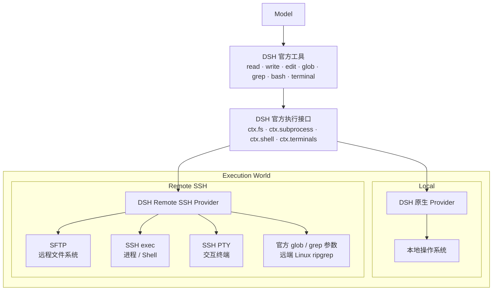

# DSH Remote SSH

[简体中文](./README.zh-CN.md) | [English](./README.md)

让 **DeepSeek Harness（DSH）** 在不更换官方工具的前提下，把同一套 `read / write / edit / glob / grep / bash / terminal` 从本地执行切换到远程 Linux 服务器。

> 社区项目，与 DeepSeek 官方无隶属或背书关系。

## 功能

- 保留 DSH 官方工具，不向模型新增 `ssh_*`、`remote_*` 等替代工具。
- 同一对话中可在本地电脑与已配置的 Linux 服务器之间切换执行环境。
- 远程文件访问通过 SFTP，命令与 Shell 通过 SSH exec，交互式终端通过 SSH PTY。
- `glob / grep` 继续使用 DSH 官方搜索调用方式；所需 ripgrep 会按远端 Linux 环境解析并缓存。
- `cwd` 只是默认工作目录，不是文件系统边界；实际访问范围由远端 SSH 账号权限决定。
- 支持 SSH Agent、私钥文件、临时密码三种认证方式。
- 首次连接支持 SSH Host Key 指纹确认。
- 目标 Linux 服务器无需安装本插件、DSH、Node.js 或 Python。
- 执行环境切换会显示在对话时间线中，但该 UI 标记不会作为用户/助手消息发送给模型。

## 快速开始

前提：已经安装并可以正常运行 DeepSeek Harness，且 `dsh` 与 `pnpm` 可在命令行中使用。

### 安装

通过 DSH 的 Profile 插件机制直接从 GitHub 安装：

```bash
dsh plugin --profile web add github:NaNQiQ/DeepSeek-Harness-remote-ssh
dsh web
```

安装后如需确认 Bundle 已进入 Web Profile：

```bash
dsh --profile web --dump-config
```

输出中应包含：

```text
dsh-remote-ssh
```

### 更新

```bash
dsh plugin --profile web update dsh-remote-ssh
dsh web
```

如果你安装时固定了 Git tag 或 commit，更新仍会遵循该固定版本；需要切换版本时，重新安装目标 tag / commit 即可。

### 卸载

```bash
dsh plugin --profile web remove dsh-remote-ssh
```

然后重新启动 DSH。

### 安装指定版本

需要固定版本时，可在 GitHub package spec 后追加 tag 或 commit：

```bash
dsh plugin --profile web add github:NaNQiQ/DeepSeek-Harness-remote-ssh#<tag-or-commit>
```

README 不绑定具体版本号；每个版本的变更请查看 [CHANGELOG.md](./CHANGELOG.md) 与 GitHub Releases。

## 使用

启动 DSH Web 后：

1. 打开执行环境选择器。
2. 选择“添加服务器”。
3. 填写服务器地址、SSH 端口与用户名。
4. 选择 SSH Agent、私钥文件或临时密码认证。
5. 首次连接时核对 Host Key 指纹。
6. 测试并保存服务器。
7. 在当前对话中切换到目标服务器。

切换后，模型仍然看到 DSH 官方工具；变化的是这些工具背后的执行位置。

## 架构



核心原则：

```text
原生 DSH @ Linux
        ≈
DSH @ 本地电脑 + DSH Remote SSH → 同一台 Linux
```

插件只改变 **DSH 在哪里执行**，不改变 **模型如何使用 DSH 工具**。

更详细的实现与边界见 [ARCHITECTURE.md](./ARCHITECTURE.md)。

## 认证方式

### SSH Agent（推荐）

插件向系统 SSH Agent 请求签名，不从 Agent 导出私钥正文。

同一把 Agent 密钥可以授权到多台服务器。服务器只需要在 `~/.ssh/authorized_keys` 中保存对应的**公钥**。

本插件不启用 SSH Agent Forwarding。

### 私钥文件

服务器配置中保存的是私钥文件路径。建立连接时，插件会读取所选私钥文件。

如果私钥带有 passphrase，优先建议先把密钥加入 SSH Agent，再使用 Agent 模式。

### 密码（临时）

密码只保存在当前 DSH Host 进程内存中，用于当前进程生命周期内的连接与重连。

密码不会写入插件状态文件，也不会写入浏览器 `localStorage` / `sessionStorage`。DSH Host 重启后需要重新输入。

## 远端要求

当前远程执行目标为 Linux / POSIX SSH 主机，需要：

- 可用的 SSH / SFTP 服务；
- 当前 SSH 账号具备所需文件与命令权限；
- 可执行常规 POSIX Shell 命令。

不要求在服务器上预先安装：

- DSH Remote SSH；
- DeepSeek Harness；
- Node.js；
- Python。

搜索功能需要的 ripgrep 由插件按远端环境处理并缓存，不要求用户手动配置系统 `rg`。

## 安全说明

- 模型提供商 API Key、模型 Base URL 等配置由 DSH 管理，本插件不读取或保存这些信息。
- 首次连接可以核对 SSH Host Key 指纹，避免静默信任未知主机。
- 远程执行权限等同于所使用的 SSH 账号权限。
- Remote Provider 不向远端执行环境暴露 DSH Host 的本地文件系统。
- 本地模式保持原生 DSH 行为：如果当前本地系统用户本身有权读取某个文件，本插件不会额外通过 Prompt 或路径黑名单改变该权限模型。

更多安全说明见 [SECURITY.md](./SECURITY.md)。

## 兼容性

本项目基于 DeepSeek Harness 的 Bundle、Provider 与 Web Client 扩展接口实现，不修改 DSH 源码。

DSH 仍在持续演进。项目不会在 README 中写死某个 DSH 应用版本，也不承诺未经验证的未来版本一定兼容；如果上游接口发生不兼容变更，本插件可能需要同步更新。

## 文档

- [ARCHITECTURE.md](./ARCHITECTURE.md) — 架构、执行边界与实现说明
- [SECURITY.md](./SECURITY.md) — 安全模型与凭据处理
- [CHANGELOG.md](./CHANGELOG.md) — 版本变更记录
- [CONTRIBUTING.md](./CONTRIBUTING.md) — 开发与贡献说明

## 相关项目

- [DeepSeek Harness](https://github.com/deepseek-ai/deepseek-harness) — 本插件的宿主项目与适配目标

## 友链

- [LINUX DO](https://linux.do/)

## License

[MIT](./LICENSE)
